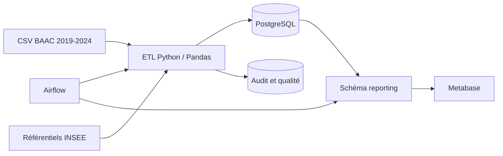

# Architecture technique

## Principes

- composants libres et reproductibles avec Docker Compose ;
- grain décisionnel explicite : une ligne par accident ;
- séparation entre entrepôt, audit et restitution ;
- chargements idempotents ;
- secrets locaux exclus de Git pour la sécurité ;
- orchestration observable avec Airflow.

## Vue d’ensemble

## Responsabilités

| Composant | Responsabilité |
|---|---|
| Docker Compose | démarrage et réseau des conteneurs |
| Airflow | ordre des tâches, reprise et historique |
| Python/Pandas | extraction, nettoyage, agrégation et chargement |
| PostgreSQL | modèle en étoile, audit et vues analytiques |
| Metabase | exploration et tableau de bord |

## Schémas PostgreSQL

- `staging` : tables temporaires de chargement ;
- `dw` : dimensions et table de faits ;
- `audit` : exécutions, volumes et résultats qualité ;
- `reporting` : vues prêtes pour Metabase.

## Flux d’exécution

1. vérifier les fichiers BAAC et INSEE ;
2. exécuter les tests unitaires ;
3. extraire et normaliser les fichiers ;
4. agréger usagers, véhicules et lieux au grain accident ;
5. contrôler puis charger PostgreSQL ;
6. publier les vues du schéma `reporting` ;
7. consulter les résultats dans Metabase.

L’ETL reste exécutable sans Airflow pour faciliter le développement et le diagnostic.
