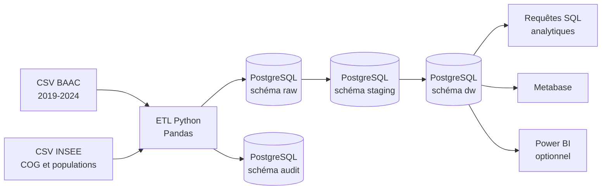

# Architecture technique

## Principes

- Architecture simple et explicable.
- Composants libres et exécutables avec Docker Compose.
- Séparation des données brutes, intermédiaires, décisionnelles et d'audit.
- Chargements reproductibles et idempotents.
- Aucun secret dans Git.

## Vue d'ensemble

## Couches PostgreSQL

### `raw`

Copie fidèle des fichiers après ingestion. Les colonnes sont majoritairement conservées en texte pour éviter toute perte lors de l'extraction.

### `staging`

- normalisation des noms de colonnes ;
- conversion des types ;
- harmonisation des codes inconnus ;
- traitement des lieux multiples ;
- agrégation des véhicules et usagers par accident ;
- enrichissement géographique.

### `dw`

Schéma en étoile composé de `fact_accident` et de dimensions conformes.

### `audit`

- historique des exécutions ;
- volumétrie par étape ;
- contrôles qualité ;
- rejets et motifs de rejet.

## Reproductibilité

PostgreSQL et Metabase sont lancés par Docker Compose. L'ETL est exécuté dans un conteneur Python dédié. Les paramètres non secrets sont documentés dans `.env.example`.

