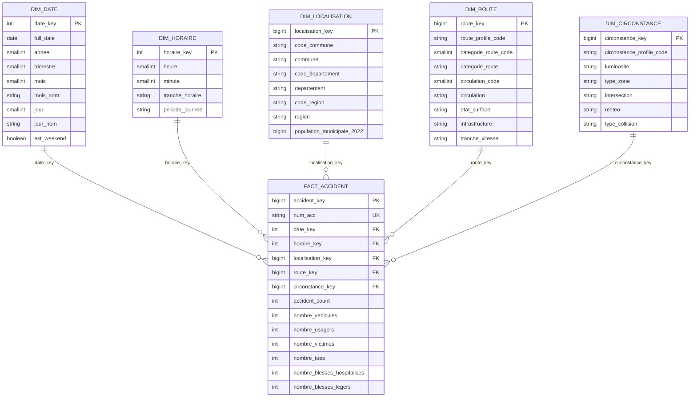

# Modèle dimensionnel

## Processus métier

Le processus étudié est la survenue d'un accident corporel de la circulation.

## Granularité

La granularité de `dw.fact_accident` est :

> Une ligne représente un accident identifié par `num_acc`.

Les véhicules et usagers sont agrégés par accident avant le chargement. Cette règle évite les doubles comptages et garantit l'additivité de `accident_count`.

## Schéma en étoile



## Dimensions

### `dw.dim_date`

Une ligne par date civile entre 2019 et 2024. La clé est au format `AAAAMMJJ`.

Hiérarchies :

```text
Année -> Trimestre -> Mois -> Date
Année -> Semaine -> Date
```

### `dw.dim_horaire`

Une ligne par minute de la journée, soit 1 440 lignes plus la ligne inconnue.

Périodes :

```text
00:00-05:59 : Nuit
06:00-11:59 : Matin
12:00-17:59 : Après-midi
18:00-23:59 : Soir
```

### `dw.dim_localisation`

Une ligne par code de commune. La dimension est enrichie avec le COG 2024, les communes historiques, les collectivités d'outre-mer et les populations 2022.

Hiérarchie :

```text
Région -> Département -> Commune
```

L'adresse, la latitude et la longitude restent dans la table de faits car elles décrivent l'événement, pas la commune.

### `dw.dim_route`

Une ligne par profil routier distinct. Le profil est constitué des attributs analytiques suivants :

- catégorie de route ;
- régime de circulation ;
- nombre de voies ;
- voie réservée ;
- profil en long ;
- tracé ;
- état de la surface ;
- infrastructure ;
- situation ;
- vitesse maximale et tranche de vitesse.

`route_profile_code` est une empreinte stable de ces attributs normalisés.

### `dw.dim_circonstance`

Dimension composite regroupant :

- luminosité ;
- type de zone ;
- intersection ;
- conditions atmosphériques ;
- type de collision.

`circonstance_profile_code` est une empreinte stable de la combinaison.

## Table de faits

### Identifiants et clés étrangères

- `accident_key` : clé technique PostgreSQL.
- `num_acc` : identifiant métier dégénéré, unique.
- clés étrangères vers les cinq dimensions.

### Mesures additives

- `accident_count`, toujours égal à 1 ;
- nombres de véhicules et d'usagers ;
- nombres de victimes, tués et blessés ;
- nombres de conducteurs, passagers et piétons ;
- nombres de véhicules légers, deux-roues et poids lourds ;
- nombre d'enregistrements de lieu.

### Attributs événementiels

- adresse ;
- latitude et longitude ;
- nom de la voie principale ;
- indicateur multi-voies ;
- millésime source ;
- date de chargement.

## Membres inconnus

Chaque dimension possède un membre de clé `0` :

```text
Code = N/C
Libellé = Non renseigné
```

Une valeur source absente ou non conforme est rattachée à ce membre. La ligne n'est jamais supprimée pour la seule raison qu'une dimension est inconnue.

## Règle des lieux multiples

À partir de 2023, un accident peut comporter plusieurs voies dans `lieux`.

La voie principale est sélectionnée par `ROW_NUMBER()` ou son équivalent Python, partitionné par `num_acc`, avec l'ordre suivant :

1. catégorie la plus structurante : autoroute, nationale, départementale, communale, autres ;
2. ligne dont le nom de voie est renseigné ;
3. numéro d'ordre de la ligne dans le fichier source.

Les informations suivantes sont conservées dans le fait :

- `nombre_lieux_associes` ;
- `est_multi_voies` ;
- `voie_principale`.

Cette règle est déterministe et évite la duplication des accidents. Elle doit être mentionnée comme une simplification analytique dans le rapport.

## Agrégation des usagers

Regroupement par `num_acc` :

```text
nombre_usagers                 = COUNT(*)
nombre_indemnes                = SUM(grav = 1)
nombre_tues                    = SUM(grav = 2)
nombre_blesses_hospitalises    = SUM(grav = 3)
nombre_blesses_legers          = SUM(grav = 4)
nombre_victimes                = nombre_tues
                                + nombre_blesses_hospitalises
                                + nombre_blesses_legers
nombre_conducteurs             = SUM(catu = 1)
nombre_passagers               = SUM(catu = 2)
nombre_pietons                 = SUM(catu = 3)
```

## Agrégation des véhicules

Regroupement par `num_acc` :

```text
nombre_vehicules = COUNT(DISTINCT id_vehicule)
```

Les regroupements de catégories de véhicules seront documentés dans les règles ETL avant leur implémentation.

